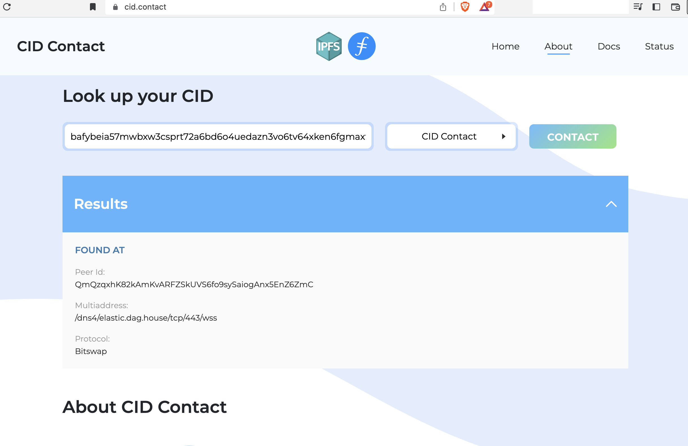
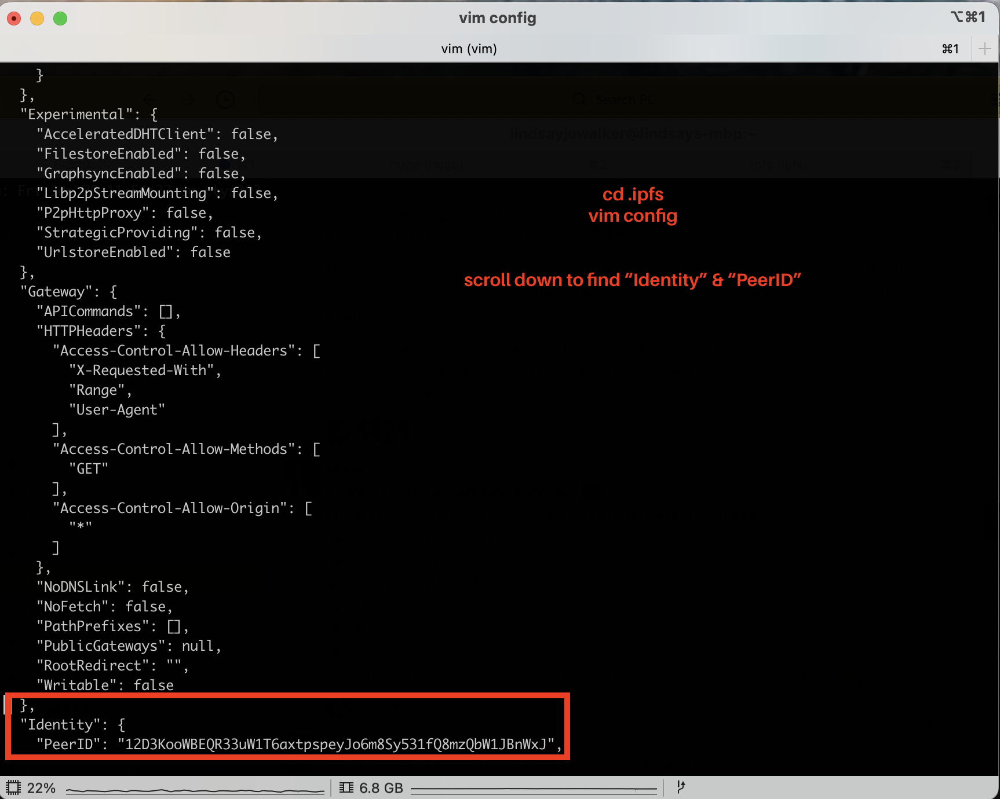
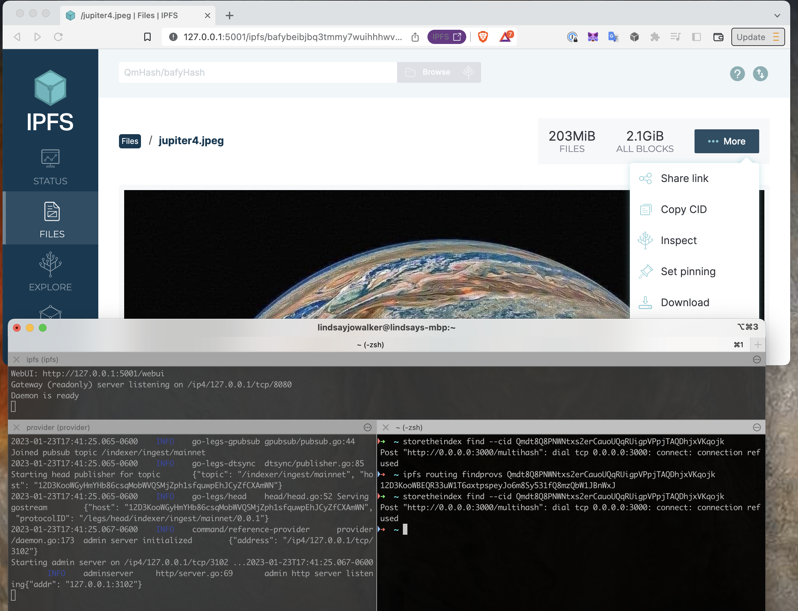

## <Dev Tool> Introduction
The [IPNI network indexer](https://github.com/ipni) is a project created and maintained by Protocol Labs that is designed to index the data on the Filecoin and IPFS networks, and work alongside the Distributed Hash Table (DHT) employed by both the IPFS and Filecoin networks to enable the fast and efficient retrieval of content-addressed data.

## Why Use Indexed Content Routing?
Protocol Labs' Network Indexer (IPNI) enables any user or developer to query both the IPFS and Filecoin public nodes to find content-addresses data using the [CID](../ipfs/content-addressing/#content-addressing).

Since IPFS and Filecoin use different protocols to retrieve data (IPFS uses Bitswap, and Filecion uses Graphsync), there is a need for a solution that makes it possible for anyone who would want to retrieve and use that data to locate and understand which protocol they can use to retrieve that data and use it in other applications.

With versions of kubo 16 and above, a feature was implemented that makes it possible to use HTTP to send and receive information about IP addresses of peers that have certain content (CIDs) and publish IPNS records.

The Indexer also makes it possible, in a way not achieved before, for people to retrieve data from the Filecoin network, as there is a lot of data stored across Filecoin nodes, but  no way to search and retrieve that data searching either by the CID of multihash of that data.

Though the DHT is an amazing, distributed way to advertise and discover content, the IPFS indexer adds another layer that can give you other options for retrieving files for your applicaitons. With an open protocol that anyone can use, as seen here in the [go-delgated-routing](https://github.com/ipfs/go-delegated-routing) library on their server.
to enable faster discovery and routing, along with load balancing and an alternative market where routing is done, besides the DHT.

Laern more about IPFS Indexer, the motivations behind it, and potential use cases, see the video **[State of Content Routing| IPFS Camp Lisbon 2022](https://www.youtube.com/watch?v=DLCTEXbF1Es)**


## Indexer Implementations
Since Filecoin and IPFS store data on separate networks, using different methods of data transfer, there are who different ways that the information about the CIDs are communicated to IPNI.

### Filecoin Indexers
Storage providers such as [Estuary](https://estuary.tech/) who store on Filecion can publish their content to the indexer using [index-provider](https://github.com/ipni/index-provider) library. When a deal is made and data is published to Filecoin, the would also [advertise](https://github.com/ipni/storetheindex/blob/main/api/v0/ingest/schema/schema.ipldsch#L40) to IPNI. This means that the CIDs and the information about the data in that CID is published on libp2p to a topic that IPNI follows.

### IPFS Indexers
When data is added to the IPFS network via kubo version 16 and above, there is an API used with the Reframe or [go-delegated-routing](https://github.com/ipfs/go-delegated-routing) that is used to send data about those CIDs in IPNI. Anyone who published to ipfs using Kubo can configure their node to advertise CIDs into both the DHT and IPNI.

#### Reframe
[Reframe](https://github.com/ipfs/go-delegated-routing) is a Request-response Protocol (RPC) used by IPFS kubo 16+ that kicks off a procedure or subroutine to execute on the IPFS network that stores the data in an index, and allows others to retrieve information related to that CID.
With versions of kubo 16+, the Refame RPC is integrated as a feature
* Reframe adds an additional way to discover peers, content, and IPNS records
* With Reframe, you can configure your IPFS kubo node to publish a snapshot of all of the CIDs on your node at whatever frequency you would like
* Reframe uses HTTP transport to store this information on an indexer node
* Reframe is an alternative to the DHT
* Content can be published to both the IPFS DHT and Reframe with a tool called parallel
  Reframe was created from a [kubo spec](https://github.com/ipfs/specs/blob/main/reframe/REFRAME_PROTOCOL.md) (the IPFS go implementation) that allows IPFS nodes to advertise their content to other systems besides the DHT.


## Tutorial: Search the Index
In this simple tutorial, we are going to configure and run an IPFS node to communicate data to the indexer and take a look at what that data looks like.

#### Workshop: Indexed Content Routing| IPFS Camp Lisbon 2022
See how to set up a local indexer and index-provider in this workshop from IPFS Camp 2022.



### Prerequisites
In order to participate in this activity you will need:
* [Go Version 1.18 or later](https://go.dev/doc/install) installed
  * Make sure that `GOPATH/bin` is on your `PATH`

```
$ export GOPATH=$HOME/go
$ export PATH=$PATH:$GOPATH/bin
```
* kubo (IPFS go) version 16 or above installed
  * IPFS install [Tutorial](https://curriculum.pl-launchpad.io/tutorials/ipfs-intro/setup/)
  * [Docs Instructions](http://docs.ipfs.tech.ipns.localhost:8080/install/command-line/#install-official-binary-distributions)
  * [Distributions](https://dist.ipfs.tech/#kubo)
* - [IPFS companion](https://chrome.google.com/webstore/detail/ipfs-companion/nibjojkomfdiaoajekhjakgkdhaomnch?hl=en) browser extension or [Brave browser](https://brave.com/download/) to view websites published on IPFS
- Install a [JSON formatter extensio](https://chrome.google.com/webstore/detail/json-formatter/bcjindcccaagfpapjjmafapmmgkkhgoa?hl=en)n for your web browser

### Tutorial Instructions
You can see the video of the workshop called **[Indexed Content Routing](https://www.youtube.com/watch?v=aN7fGturjzA&t=121s)** from IPFS Camp Lisbon 2022. The original instructions are at [https://github.com/ischasny/ipfs-camp-routing](https://github.com/ischasny/ipfs-camp-routing).

First, lets take a look at an example IPNI record.
* Check out the Filecion Saturn website, [located at the CID bafybeia57mwbxw3csprt72a6bd6o4uedazn3vo6tv64xken6fgmaxtiugy](https://bafybeia57mwbxw3csprt72a6bd6o4uedazn3vo6tv64xken6fgmaxtiugy.ipfs.dweb.l).
* Now, look up this CID on [CID contact](https://cid.contact/)
  
* You can also see that same information by constructing the cid.contact url like so `https://cid.contact/cid/<CID>` this one is located at [https://cid.contact/cid/bafybeia57mwbxw3csprt72a6bd6o4uedazn3vo6tv64xken6fgmaxtiugy](https://cid.contact/cid/bafybeia57mwbxw3csprt72a6bd6o4uedazn3vo6tv64xken6fgmaxtiugy)
* Take a look at the providers wha=o are broadcasting CIDs to the network at [https://cid.contact/providers](https://cid.contact/providers)

### Set up a Local Indexer
You can see the documentation, CLI commands, and thorough instructions at [https://github.com/filecoin-project/storetheindex/#install](https://github.com/filecoin-project/storetheindex/#install).

Install storetheindex:

```
$ go install github.com/filecoin-project/storetheindex@v0.4.28
```

Initialize the storetheindex repository and configuration:

```
$ storetheindex init
```

Start the indexer

```
$ storetheindex daemon
```


### Set Up Kubo

[Install Kubo v0.16.0](https://curriculum.pl-launchpad.io/tutorials/ipfs-intro/setup/) or use already configired node. _It's important to make sure that you are on v0.16.0+ version of Kubo or otherwise Reframe won't work._ Initialize a node with `ipfs init`.

> If you already have an ipfs node running on your machine, you can configure the existing `.ipfs/config` file, or else create (`ipfs init`) a new IPFS node for this tutorial, and make a backup copy of the `with cp ~/.ipfs ~/..ipfs` config file, or initialize a new node in a sandboxed vm or container.


Set up custom routing. In a new terminal window, rung this command to configure custom routing:

```
ipfs config Routing --json  '{
  "Type": "custom",
  "Methods": {
    "find-peers": {
      "RouterName": "WanDHT"
    },
    "find-providers": {
      "RouterName": "ParallelHelper"
    },
    "get-ipns": {
      "RouterName": "WanDHT"
    },
    "provide": {
      "RouterName": "ParallelHelper"
    },
    "put-ipns": {
      "RouterName": "WanDHT"
    }
  },
  "Routers": {
    "CidContact": {
      "Parameters": {
        "Endpoint": "http://127.0.0.1:50617"
      },
      "Type": "reframe"
    },
    "ParallelHelper": {
      "Parameters": {
        "Routers": [
          {
            "IgnoreErrors": true,
            "RouterName": "CidContact",
            "Timeout": "30m"
          },
          {
            "ExecuteAfter": "2s",
            "IgnoreErrors": true,
            "RouterName": "WanDHT",
            "Timeout": "30m"
          }
        ]
      },
      "Type": "parallel"
    },
    "WanDHT": {
      "Parameters": {
        "AcceleratedDHTClient": true,
        "Mode": "dhtserver",
        "PublicIPNetwork": true
      },
      "Type": "dht"
    }
  }
}'
```

Now if you look in your `.ipfs/config` file, you should see a `Routing` object, which you can modify for a custom setup:
```json
 "Routing": {
    "Methods": {
      "find-peers": {
        "RouterName": "WanDHT"
      },
      "find-providers": {
        "RouterName": "ParallelHelper"
      },
      "get-ipns": {
        "RouterName": "WanDHT"
      },
      "provide": {
        "RouterName": "ParallelHelper"
      },
      "put-ipns": {
        "RouterName": "WanDHT"
      }
    },
    "Routers": {
      "CidContact": {
        "Parameters": {
          "Endpoint": "http://127.0.0.1:50617"
        },
        "Type": "reframe"
      },
      "ParallelHelper": {
        "Parameters": {
          "Routers": [
            {
              "IgnoreErrors": true,
              "RouterName": "CidContact",
              "Timeout": "30m"
            },
            {
              "ExecuteAfter": "2s",
              "IgnoreErrors": true,
              "RouterName": "WanDHT",
              "Timeout": "30m"
            }
          ]
        },
        "Type": "parallel"
      },
      "WanDHT": {
        "Parameters": {
          "AcceleratedDHTClient": true,
          "Mode": "dhtserver",
          "PublicIPNetwork": true
        },
        "Type": "dht"
      }
    },
    "Type": "custom"
  },
```

Start the IPFS node:

```
$ ipfs daemon
```

In the`.ipfs/config` file, find the "Identity" field and write down the `PeerID`:



### Set Up an index-provider Node

See [https://github.com/ipni/index-provider#install](https://github.com/filecoin-project/index-provider#install) for full instructions on run a standalone provider daemon instance.

Install index-provider:

```
$ go install github.com/filecoin-project/index-provider/cmd/provider@v0.9.0
```

Initialise the index-provider repository and configuration:

```
$ provider init
```

Add a direct http announcement (optional) and Reframe configuration:

```
$ vim ~/.index-provider/config
```

Add the following configuration block replacing the ProviderID with the kubo node peer ID grabbed at the previous step:

```
 "DirectAnnounce": {
    "URLs": [
      "http://127.0.0.1:3001"
    ]
  },
  "Reframe": {
    "ListenMultiaddr": "/ip4/127.0.0.1/tcp/50617",
    "ChunkSize": 1,
    "SnapshotSize": 100,
    "ProviderID": "KUBO_NODE_PEER_ID",
    "Addrs": [
      "/ip4/0.0.0.0/tcp/4001",
      "/ip6/::/tcp/4001",
      "/ip4/0.0.0.0/udp/4001/quic",
      "/ip6/::/udp/4001/quic"
    ]
  }
```

Start the index-provider:

```
$ provider daemon
```

### See It In Action

Make sure `ipfs daemon` is running and open up a WebUI at [http://127.0.0.1:5001/webui](http://127.0.0.1:5001/webui) and upload a file.

Take a note of it's CID.

Once upoloaded you should see logs start rolling in `storetheindex` and `indexprovider` command lines.

Open a new terminal window and check whether your cid got indexed by executing

```
$ storetheindex find --cid <CID>
```

Or look it up in Kubo

```
ipfs routing findprovs <CID>
```



#### Resources
* [Blog: Introducing the Network Indexer](https://filecoin.io/blog/posts/introducing-the-network-indexer/)
* [Blog: Introducing Reframe](https://blog.ipfs.tech/2022-09-02-introducing-reframe/)
* [CID Contact](https://cid.contact/) a web user interface (webUI) you can use to access data.
* [Github ipni/storetheindex](https://github.com/ipni/storetheindex)
* [Github ipfs/go-delegated-routing](https://github.com/ipfs/go-delegated-routing)
* [Filecoin Slack Channel #storetheindex](https://cid.contact/)
* [Weekly Status Report](https://www.notion.so/pl-strflt/Weekly-Status-Report-30699cbe5a99473ea98b4ea4f9a3619b)
