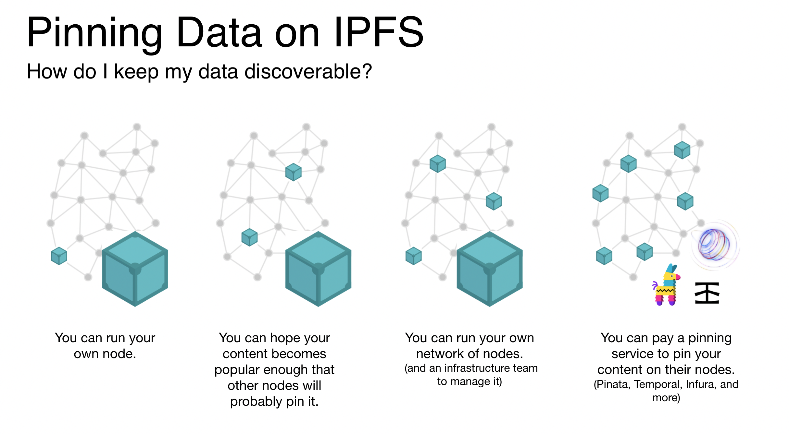

## The Importance of Immutabilty

IPFS allows us to verify the content we received is the content we asked for using hashes.
* Hashes are deterministic, meaning given an input, it will always have the same output. If the input data changes in any way, then the output generated hash will also change.
* Since files are immutable, they can never change without generating a brand new hash and, by extension, CID.
* IPFS enables fast caching and deduplication, which means that you can save space by just communicating any changes to a file.
* IPFS allows you to fetch the data you want from anyone, using the immutable CIDs.

## Anatomy of a Content Identifier (CID)

CIDs are unique strings. There must be a way to future proof the seemingly infinite amount of data that will be added on to the network.
* Metadata about a hash (aka a prefix) + the hash itself = CID
* The collection of “metadata prefixes” used in CIDs are part of the [Multiformats](https://multiformats.io/) library.
* Currently, there are 2 different versions of CIDs in IPFS, CIDv0 & CIDv1, the currently widely accepted one being v1 CIDs. The version is also prefixed in the CID itself.
* The Multiformat protocols ensure future-proof compatibility and standards if any algorithm needs to change.



## Content Addressing

### Why location addressing fails us

* A URL only points to a single copy, stored in a single location.
* If that copy disappears, there is no way to know where other copies are.
* It is not possible for a user to validate the integrity of the content:
  * A malicious actor can poison DNS, or change the copy’s location, without the end user noticing.
  * HTTPS is an improvement, but only secures the transport, not the content.
* No request aggregation, resulting in duplication of effort and bandwidth waste (i.e. no options for multicast in the wild).

### Location- vs Content-Addressing

Location addressing asks exactly one remote host for content by name (which may or may not be related to the content).

Content addressing can ask anyone for content by the fingerprint (hash) of that content since the relationship between the fingerprint and the content is immutable. Since we can verify the content we receive matches the fingerprint, it doesn't matter who we receive the content from.

#### How IPFS Works | Steve Allen
In this video, Steve Allen describes how IPFS **Imports, Names, Finds** and **Fetches** content.



At a high level, the talk covered the following concepts:

#### Import
* [Chunking](https://docs.ipfs.io/concepts/file-systems/#unix-file-system-unixfs) – When an object is added to IPFS, it is chunked up into smaller parts, each part is hashed, and a CID is created for each chunk. This DAG building process has two main parameters, the leaf format and the chunking strategy.
* [UnixFS](https://docs.ipfs.io/concepts/file-systems/#unix-file-system-unixfs) – When you add a file to IPFS, it might be too big to fit in a single block, so it needs metadata to link all its blocks together. UnixFS is a protocol-buffers-based format for describing files, directories, and symlinks in IPFS. This data format is used to represent files and all their links and metadata in IPFS. UnixFS creates a block (or a tree of blocks) of linked objects.
* [IPLD](https://docs.ipfs.io/project/related-projects/#ipld) – A meta-format for understanding, encoding, and decoding Merkle-linked data. IPLD makes it possible to define a data model and link together different types of Merkle-linked data.

#### Name
* [Content IDentifiers (CIDs)](https://docs.ipfs.io/concepts/content-addressing/#content-addressing-and-cids) – These are self-describing hashes used to describe everything stored in IPFS, essentially a hash with some metadata.
* Paths – Paths are recursive unlike URLs and can refer to previous blocks.
* [IPNS](https://docs.ipfs.io/concepts/ipns/#interplanetary-name-system-ipns) – Public keys are mapped to a CID and you use your private key to sign it. As you modify this content, you can use IPNS to point to the new CID.

{}
#### Find
* [Routing & DHT](https://docs.ipfs.io/concepts/dht/#distributed-hash-tables-dhts) – Content on IPFS uses a combination of a CID and routing systems that help identify the set of peers you can get the content from with a distributed routing table (or Distributed Hash Table).
* [Kademlia](https://docs.ipfs.io/concepts/dht/#kademlia) – Kademlia is a distance metric + query algorithm that helps users find the peers with the most accessible pieces of data.

#### Fetch
* [Bitswap](https://docs.ipfs.io/concepts/bitswap/#how-bitswap-works) – Using wantlists of data, or CIDs, that specific users are looking for, and checks peers that a node is connected to first for those CIDs before querying the rest of the DHT.
{}

## Pinning Content on IPFS

By default, content on IPFS is not _pinned_. That means when you add a file to IPFS, it will eventually stop being discoverable on the network. 

This problem occurs because IPFS uses garbage collection to free disk space on your IPFS node by deleting data that is no longer needed. [Garbage collection](https://en.wikipedia.org/wiki/Garbage_collection_(computer_science)) is a form of automatic resource management widely used in software development.

To mitigate this problem you must _pin_ your content to your [node](https://docs.ipfs.tech/concepts/nodes/#nodes) to ensure it persists on IPFS. Your options for pinning content are:
1. You pin it locally to your own node. Note that if the content is only pinned to your local node, it must be online for peers to get that content.
2. You use a [pinning service](https://docs.ipfs.io/concepts/persistence/#pinning-services). Some pinning services require payment for their services, others offer a [free storage allowance for new users](https://docs.ipfs.tech/concepts/persistence/#ipfs-filecoin-solutions).

Check out this article to find out more about [permanence on IPFS](https://docs.ipfs.tech/concepts/persistence/).

{}
## More IPFS Concepts
_You can also [find this content in IPFS Docs](https://docs.ipfs.io/concepts/)_

Because IPFS is a system that hopes to change how we use the Internet, it comes with many new concepts:

#### Whiteboard Series with NEAR | Ep: 42 Adin Schmahmann



{}