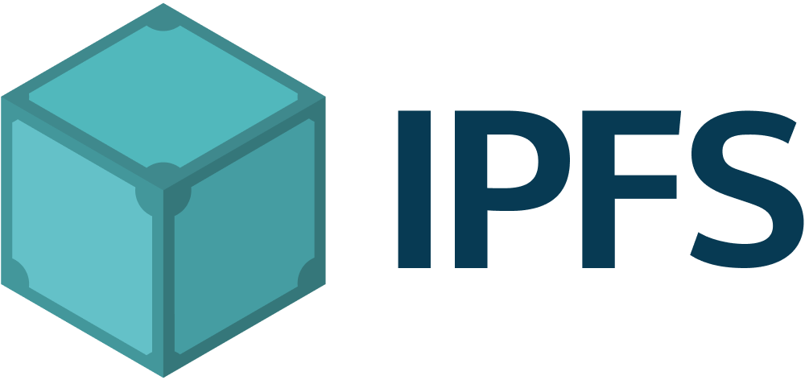

**IPFS** stands for **I**nter**P**lanetary **F**ile **S**ystem.

IPFS is a distributed system for storing and accessing files, websites, applications, and data. Read more about how this works [in the docs](https://docs.ipfs.io/concepts/what-is-ipfs/).

IPFS aims to [decentralize the web](https://docs.ipfs.io/concepts/what-is-ipfs/#decentralization) and connects people to information using [content addressing](https://docs.ipfs.io/concepts/what-is-ipfs/#content-addressing) instead of URLs and servers.

The mission of **IPFS** is to create a resilient, upgradable, open network to preserve and grow humanity's knowledge.

### Shallow Dive Goals
* **1.0 –** Understand what web3 and peer-to-peer networking is, as well as how and why IPFS was started
* **1.1 –** Know what Content Addressing, DAGs, and CIDs are and what advantages they presents over location-based addressing
* **1.2 –** Be able to explain how content is shared on IPFS
* **1.3 –** Know what a gateway is, how it helps to bridge users of web2 & web3, and be able to identify gateway providers

### Deep Dive Goals
* **1.4 –** IPFS data transfer: know what mechanisms act on control plane vs the data plane in IPFS & the tools we use for data transfer
* **1.5 –** Understand the IPFS architecture, how things are verified on IPFS
 **1.6 –** Understand what UnixFS is, how it is structured & why it is built the way it is
