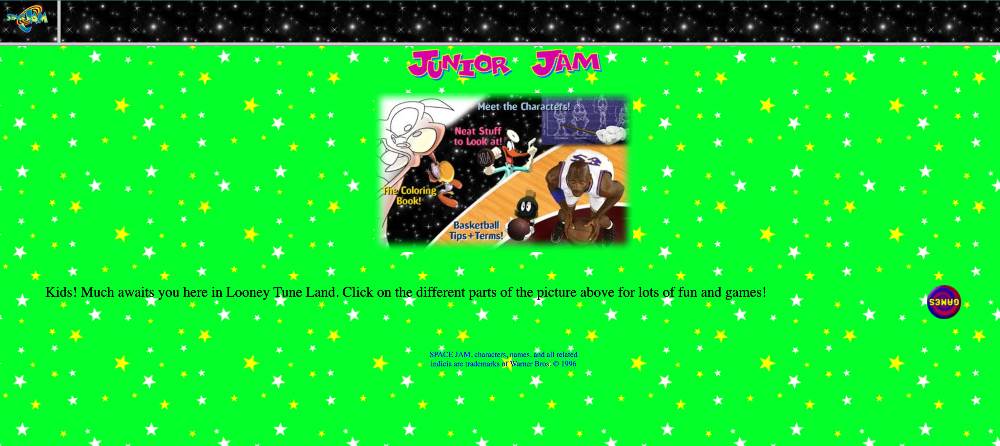

## Overview

Web 1.0: In the era of Web 1.0, most users were passive consumers of content. (READ)

Web 2.0: In the era of Web 2.0, users created most of the content on the internet, making the internet interactive and social. The problem? Lack of data privacy, and growing monopoly by major players (Facebook, Google, Apple, etc.). (READ-WRITE)

Web 3.0: Web 3 refers to an internet built upon decentralized networks, such as Bitcoin and Ethereum. The key innovation of these networks is the creation of platforms that no single entity controls, yet everyone can still trust. (READ-WRITE-OWN)

## Examples

Web1 -- [Space Jam Website](https://www.spacejam.com/1996/)

Web2 -- An example social media page

Web3 -- There is not a good way to represent the look of web3, because it is all
about transforming the back-end to be more decentralized. It's not just about
crypto-currencies, but comprises any effort to provide internet services in a
decentralized manner, whether money, storage, computation, etc. All of these
logos represents groups who are building in the space.

